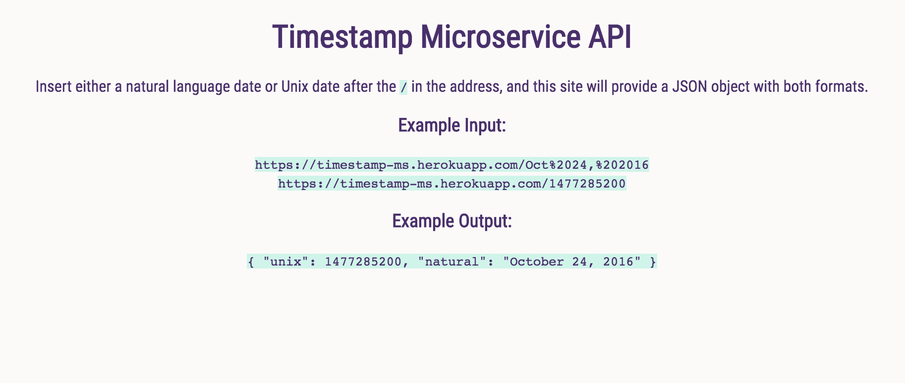

# timestamp-microservice

(Node.js, HTML/CSS) A microservice API that will take the URL query parameters and generate a JSON object with both the Unix and natural language dates. The parameters must be in either the Unix or natural language format, though the natural language format will allow abbreviated month names (ex. 'Sep', 'Sept' or 'September').

This was a quick, fun one. I did the learnyounode tutorials and reviewed notes from the prior week's class on creating servers using the HTTP module. It turned out to be a nice project for bringing all of that learning together.

This is one of the [Free Code Camp API projects](https://www.freecodecamp.com/challenges/timestamp-microservice). 

[Live on Heroku](https://sheltered-lowlands-41267.herokuapp.com/)

